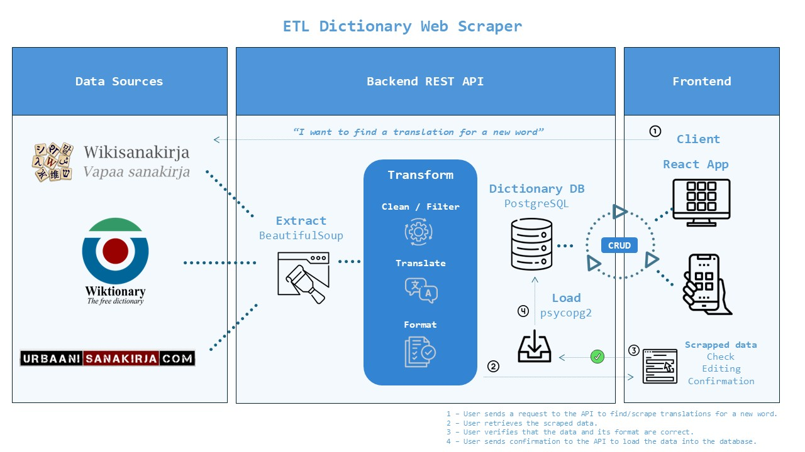

# ETL Dictionary Web Scraper

This project demonstrates an **ETL (Extract, Transform, Load)** process to fetch translations and definitions for finnish words using web scraping techniques. 
The goal is to extract data from various online sources, transform it into a structured format, and load it into a PostgreSQL database—all while exposing the functionality via a REST API built with FastAPI.

It is part of my personal application for learning Finnish. While the complete app includes a [frontend component for user interaction](https://github.com/oiivantsov/dictionary-frontend), this repository focuses solely on the **backend ETL process**.


## Technologies Used

- **Backend**: Python, FastAPI
- **Database**: PostgreSQL
- **Web Scraping**: BeautifulSoup, Requests
- **Containerization**: Docker, Docker Compose


## Overview

This project is designed to showcase a complete ETL pipeline that:
- **Extracts**: Scrapes word translations and definitions from multiple online resources (e.g., [Wiktionary](https://en.wiktionary.org/wiki/Wiktionary:Main_Page), [Wikisanakirja](https://fi.wiktionary.org/wiki/Wikisanakirja:Etusivu), and [Urbaani Sanakirja](https://urbaanisanakirja.com/)).
- **Transforms**: Parses and formats the scraped data, including handling translations (e.g., using the [Deep Translator](https://pypi.org/project/deep-translator/) for language conversion) and reformatting content for consistency.
- **Review & Edit**: Before loading, users can review the extracted data and make any necessary corrections or modifications.
- **Loads**: Once reviewed, the cleaned and structured data is inserted into a PostgreSQL database.



The process is integrated into a web service that exposes endpoints to interact with the data—whether fetching fresh translations or performing CRUD operations on the stored words.


## ETL Process Flow with Frontend Integration

### Step 1: Search for a Word
Users enter a word in the **search form** and select the sources to scrape data from (**Wiktionary, Wikisanakirja, or Urbaani Sanakirja**).


### Step 2: Extract Data
After pressing the **search button**, the ETL process is triggered, scraping data from the selected sources.

### Step 3: Autofill Fields with Extracted Data
Scraped data is automatically populated into the **text fields** in the UI, allowing users to review the extracted translations, examples, and other attributes.


### Step 4: Edit and Verify Extracted Data
Users can manually edit the extracted content if necessary, ensuring the data is correct before saving it.

### Step 5: Save the Word to the Database
Once reviewed and edited, users press the **Save Word** button to store the word and its details into the PostgreSQL database.


Check out the full ETL process in action from a frontend perspective in this video: https://www.youtube.com/watch?v=O0XUDW5zMJs
[](https://www.youtube.com/watch?v=O0XUDW5zMJs)


## Docker Architecture

The system is containerized using Docker and orchestrated with Docker Compose. It consists of two primary services:

1. **Database Service**:  
   - Runs PostgreSQL (v13) as the storage backend.
   - Uses an initialization SQL script (`data_example/start_db.sql`) to create the necessary table and seed example data.

2. **Application Service**:  
   - Built with Python (using FastAPI for the web framework).
   - Implements the ETL process through various modules under the `app/utils/scrapers` directory.
   - Exposes API endpoints for web scraping, word management, and statistics.

## Setup & Installation

### Prerequisites

- [Docker](https://docs.docker.com/get-docker/) and [Docker Compose](https://docs.docker.com/compose/install/) installed on your machine.

### Running the Application

1. **Clone the Repository:**

   ```bash
   git clone https://your-repo-url.git
   cd your-repo-folder
   ```

2. **Build and Start the Services:**

   Use Docker Compose to start the PostgreSQL database and the FastAPI application.

   ```bash
   docker-compose up --build
   ```

3. **Accessing the API:**

   Once the containers are up and running, access the API at:  
   `http://localhost:8000`

4. **API Documentation:**

   Visit `http://localhost:8000/docs` to explore the automatically generated Swagger UI for interactive API testing.

## API Endpoints

The API exposes several endpoints, including:

- **Web Scraping Endpoints:**
  - `GET /api/fetch-word-eng`: Scrapes and returns data from English Wiktionary.
  - `GET /api/fetch-word-fi`: Scrapes and returns data from Finnish Wiktionary.
  - `GET /api/fetch-word-slang`: Retrieves slang definitions from the urban dictionary source.

- **Word Management Endpoints:**
  - `GET /api/words/`: Retrieves all words from the database.
  - `POST /api/words/`: Adds a new word to the dictionary.
  - `PUT /api/words/{word_id}`: Updates an existing word.
  - `DELETE /api/words/{word_id}`: Deletes a word.

- **Additional Endpoints:**
  - `GET /api/words/search`: Searches words by name or translation.
  - `GET /api/words/stats`: Provides statistical data about the words in the database.
  - Endpoints for filtering and bulk updating word levels for repetition purposes.

## Open Source Disclaimer

This project makes use of publicly available data from Wiktionary, Wikisanakirja, and Urbaani Sanakirja strictly for educational and non-commercial purposes. The data is utilized solely within the scope of this application to facilitate language learning and research. This project is independent and not affiliated with or endorsed by these platforms.